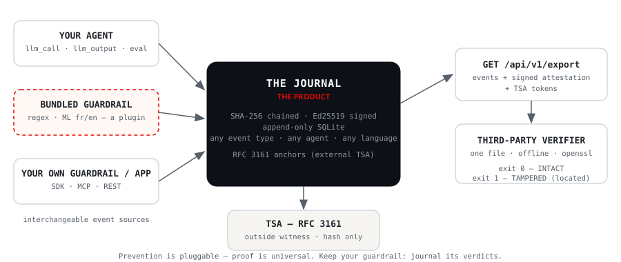

<div align="center">

[🇬🇧 English](README.md) · 🇫🇷 Français

# ⬛ NoireBox

**La boîte noire pour agents IA — journal inaltérable, garde-fous, preuve vérifiable.**

[](https://pypi.org/project/noirebox/)
[](pyproject.toml)
[](LICENSE)
[](https://github.com/astral-sh/ruff)
[](https://github.com/slabbdev/noirebox/pkgs/container/noirebox)
[](#)

**Un agent IA rédige des comptes rendus qui engagent vos clients.
Qui prouve, dans 18 mois, ce qu'il a *exactement* produit et pourquoi ?**
NoireBox scelle chaque décision dans un journal SHA-256 chaîné + Ed25519,
flague les transcripts piégés avant qu'ils n'atteignent l'agent, et exporte
une attestation que n'importe qui vérifie hors-ligne — **sans vous faire confiance**.

> **Pour n'importe quel agent, en français et en anglais.** Le journal,
> l'API, les outils MCP et le vérificateur sont universels ; chaque langue
> a son détecteur (~250 Ko) entraîné depuis un dataset reproductible (seed 42) — un nouveau
> marché = un générateur de dataset + `make train`. **Vous avez déjà un
> garde-fou ? Gardez-le** — ce n'est qu'une source d'événements de plus.
> 🇪🇺 Conçu pour le [marché européen (RGPD & AI Act)](#conçu-pour-le-marché-européen-rgpd--ai-act) — développé en France.

[Quickstart](#quickstart) · [Démo LLM réelle](#la-scène-llm-réelle-ollama-local) ·
[Specs](docs/SPECS.md) · [Threat model](docs/THREAT-MODEL.md) ·
[ADRs](docs/ADRs.md) · [Vulgarisation](docs/VULGARISATION.md)

</div>

---

## Conçu pour le marché européen (RGPD & AI Act)

Les éditeurs IA européens affrontent une réalité de conformité que leurs
concurrents américains n'ont pas : **prouver** — pas promettre — ce que leurs
systèmes ont fait. NoireBox est construit autour de cette obligation. Et
l'horloge est réelle : le suivi des incidents GPAI est **en vigueur depuis
août 2025** (art. 55(1)(c)), les obligations de transparence s'appliquent
depuis août 2026, et la journalisation high-risk arrive le
**2 décembre 2027** (AI Act tel que modifié par le Digital Omnibus,
Règl. (UE) 2026/1744) — avec des amendes jusqu'à 35 M€ / 7 % du chiffre
d'affaires.

| Exigence | Réponse NoireBox |
|---|---|
| **RGPD art. 5(2)** — responsabilité : le responsable doit *démontrer* la conformité | Journal inaltérable de ce que l'IA a produit, quand, sur quelle entrée |
| **RGPD art. 15/20** — droits des personnes (accès, portabilité) | Export signé de tout ce qui touche une réunion — vérifiable *par l'auditeur de la personne elle-même* |
| **AI Act art. 12 + 19/26(6)** — journalisation automatique, conservée ≥ 6 mois | Chaque décision d'agent scellée au runtime ; l'intégrité du log est cryptographique, pas une promesse |
| **AI Act art. 55(1)(c)** (risque systémique GPAI — en vigueur) | Incidents graves suivis, documentés, signalés — scellés comme événements de première classe (`ai_incident`) |
| **AI Act Annexe IV §2(f)** — documenter les caractéristiques de journalisation | `noirebox audit-pack` : un dossier pour l'auditeur — export + rapport du vérifieur + description de journalisation générée |
| **eIDAS art. 41** — l'horodatage qualifié emporte une présomption légale | Profils d'ancrage pour TSA qualifiées eIDAS (Universign, Certigna…), TSA publiques, et Bitcoin via OpenTimestamps — voir [ADR 008/009](docs/ADRs.md) |
| **AIPD / workflows DPO** | Attestation exportable pour le DPO ; taxonomie d'incidents nourrissant la documentation des risques |
| **Souveraineté** | Auto-hébergé, zéro télémétrie, zéro dépendance cloud, clés Ed25519 sur votre infrastructure — déploie partout (y compris clouds européens) |

> **Périmètre honnête** (nous sommes une brique, pas une certification) :
> NoireBox prouve l'*intégrité* du registre de votre IA. La minimisation des
> payloads et le stockage de clé de grade HSM relèvent du responsable de
> déploiement en v0 — voir le [threat model](docs/THREAT-MODEL.md). Un outil
> qui survend sa conformité est un passif ; un outil qui énonce son périmètre
> est auditable.

## Pourquoi

- **RGPD** : une plateforme qui affirme « conforme RGPD » doit pouvoir démontrer
  ce que son IA a produit, sur quelles données, et quand.
- **AI Act (art. 12)** : les systèmes à risque doivent tenir des *journaux
  automatiques d'événements*. Aujourd'hui, la quasi-totalité des stacks LLM
  loggent pour le *debug* — pas pour la *preuve*.
- Le trou du marché : les outils d'observabilité (Langfuse, LangSmith…) sont
  faits pour les devs, modifiables a posteriori, et ne produisent rien de
  présentable à un auditeur, un DPO ou un client.

## Positionnement honnête (state of the art)

| Outil | Ce qu'il fait | Ce qu'il ne fait pas |
|---|---|---|
| Langfuse / LangSmith / Helicone | Observabilité, debug, traces LLM | Pas de preuve inaltérable, rien d'exportable pour un audit |
| Garak / PyRIT / promptfoo | Red-team **offline** au niveau modèle | Pas de garde-fou runtime, pas de journal de preuve |
| halo-record / gate-oc-audit | Journal hashé pour agents de *code* | Pas de domaine métier, pas d'attestation tiers, pas de FR |
| **NoireBox** | **Journal inaltérable Ed25519 → ancrage RFC 3161 → attestation exportable + vérificateur autonome** (garde-fou FR/EN embarqué = une source d'événements fongible parmi d'autres ; **ancrage de flotte** : un sceau TSA couvre N journaux) | — |

**NoireBox applique le modèle Certificate Transparency aux journaux d'agents
IA :** beaucoup de journaux, une seule racine signée par un tiers horodateur,
des preuves d'inclusion que n'importe qui vérifie hors-ligne
(`noirebox/merkle.py`, `make demo-fleet`). À notre connaissance, aucun autre
outil d'audit d'agents ne le fait.

## Le cœur, c'est le journal. Le garde-fou, c'est un plugin.



Zéro ambiguïté sur ce qu'est le produit :

- **Une NoireBox par agent ou par service** — comme un boîtier de vol par
  avion. Une instance = un fichier SQLite, une paire de clés, une chaîne.
  La couche flotte (`noirebox/merkle.py`) agrège des **preuves** (têtes de
  chaîne de 32 octets), jamais des événements : votre journal ne quitte
  jamais votre infrastructure.
- **Le journal EST le produit** — chaîne, signatures, stockage append-only,
  ancrage RFC 3161, export, vérificateur autonome. Il est indépendant du
  domaine, de l'agent et de la langue : un événement, c'est un `type` libre
  et un payload, rien de plus. `chain.py`/`store.py`/`anchors.py` n'importent
  AUCUN code de détection — supprimez le garde-fou entier, tout continue
  de fonctionner.
- **La prévention est fongible** — un garde-fou n'est qu'un producteur
  d'événements parmi d'autres. Vous avez déjà Lakera, Llama Guard, votre
  LLM-juge, vos regex ? **Gardez-les.** Journalisez leurs verdicts de la
  même façon (`POST /api/v1/events`, `type: "incident"`) : leurs détections
  deviennent inaltérables et vérifiables par un tiers, au lieu de finir
  dans des logs applicatifs réinscriptibles.
- NoireBox embarque un garde-fou (regex + ML entraîné) comme **exemple
  fonctionnel de ce contrat de plugin** — et par confort si vous n'en avez
  pas. Il est remplaçable par construction ([ADR 003](docs/ADRs.md)).

> La prévention varie selon la stack. La preuve est universelle.

## Quickstart

```bash
pip install noirebox       # le moteur ML est embarqué dans le wheel (FR + EN)
pip install noirebox[pdf]  # + l'attestation PDF prête pour le DPO (extra optionnel)
noirebox serve             # API sur http://127.0.0.1:8768/docs
```

Depuis les sources :

```bash
./start.sh          # venv + deps + tests + API sur http://127.0.0.1:8768/docs
make demo           # le film complet en une commande (voir ci-dessous)
```

Ou avec Docker — Python inutile, le moteur ML est embarqué dans l'image :

```bash
docker run -p 8768:8768 ghcr.io/slabbdev/noirebox:latest
# API + docs OpenAPI sur http://127.0.0.1:8768/docs — données dans ./data
```

Démos sans serveur :

```bash
make demo                # 100 % réel : micro-modèle → journal → auditeur → pirate démasqué
make demo-mcp            # NoireBox comme outil MCP (protocole agents)
.venv/bin/python demo/demo_scan.py     # garde-fou regex sur 2 transcripts
.venv/bin/python demo/demo_tamper.py   # falsification → la chaîne explose
```

Vérifier une exportation comme un tiers (auditeur, DPO, client) :

```bash
curl -s http://127.0.0.1:8768/api/v1/export > export.json
.venv/bin/python verifier/verifier.py export.json   # exit 0 = chaîne intègre

> Le vérificateur a besoin du paquet NoireBox sur la machine de l'auditeur —
> `pip install noirebox` suffit (pas de modèle, pas de framework).
```

## Horodatage de la chaîne — des témoins extérieurs que vous choisissez (RFC 3161 + Bitcoin)

Le journal prouve l'intégrité, mais *quand* a-t-il été scellé ? Un serveur
qui date lui-même son journal, c'est le suspect qui rédige son procès-verbal.
Et le threat model gardait un trou : un opérateur possédant la clé privée
pouvait **régénérer toute la chaîne** avec de vraies signatures.

L'ancrage ferme le trou — avec des **témoins que vous choisissez, en
couches** ([ADR 006/008/009](docs/ADRs.md)) :

- **TSA qualifiées eIDAS** (Universign, Certigna…) — un horodatage qualifié
  emporte une *présomption légale* (art. 41) : la date et l'intégrité des
  données scellées sont présumées jusqu'à contestation ;
- **TSA publiques** (DigiCert, FreeTSA…) — gratuites, immédiates,
  organisations indépendantes ; l'auditeur vérifie contre des **racines
  épinglées dans ce dépôt** ([`verifier/tsa_roots/`](verifier/tsa_roots/)),
  jamais contre un certificat fourni par l'opérateur ;
- **OpenTimestamps / Bitcoin** — un reçu qu'aucun opérateur ne peut forger :
  le forger exigerait de refaire la preuve de travail du réseau ; le
  vérifier prend ~30 µs de SHA-256, valable aussi longtemps que Bitcoin.

Un seul événement `anchor` porte tous les témoins. Seul le **hash de tête de
32 octets** quitte l'infrastructure (zéro donnée, zéro exposition RGPD). Et
l'ancrage est **rétroactif** : une seule ancre externe scelle *tout* le
passé de la chaîne — une chaîne régénérée montre une tête que les tokens ne
couvrent pas, démasquée à la vérification sans aucune publication externe
préalable. Ancrez régulièrement et la fenêtre falsifiable se réduit à la
queue depuis la dernière ancre.

```bash
export NOIREBOX_TSA_PROFILES='[
  {"name": "freetsa",  "url": "https://freetsa.org/tsr"},
  {"name": "bitcoin",  "kind": "ots"}]'
export NOIREBOX_TSA_ALLOWED_HOSTS=freetsa.org
curl -X POST localhost:8768/api/v1/anchors   # un appel, deux témoins, tout le passé scellé
noirebox audit-pack ./audit                  # le dossier auditeur : export + rapport + Annexe IV §2(f)
```

Une TSA OpenSSL auto-hébergée reste livrée pour les déploiements
souverains/hors-ligne (`make tsa`) — même frontière de confiance que
l'opérateur, documentée comme telle. Le mapping réglementaire complet :
[docs/COMPLIANCE-EU.md](docs/COMPLIANCE-EU.md).

## Le garde-fou embarqué — un plugin, deux moteurs

| Moteur (`engine`) | Taille | Langues | Rôle | Dépendance |
|---|---|---|---|---|
| `regex` | ~0 | FR+EN | cas évidents, coût zéro | aucune |
| `ml` | 243–293 Ko | **fr** & **en** (paramètre `lang`) | paraphrases que le regex rate, local | scikit-learn |

**Décision d'architecture — [ADR 002](docs/ADRs.md)** : Llama Prompt Guard 2
de Meta (le classifieur de l'industrie, ~90 Mo) a été évalué puis **écarté en
connaissance de cause** : licence gated, torch/transformers en dépendances,
sortie binaire sans taxonomie d'audit. L'ADR documente aussi le **chemin
d'intégration** si vous en avez besoin un jour (adaptateur ≈ 40 lignes
derrière la même interface moteur). L'étage 2 des cas douteux reste un
LLM-juge local (`llama-guard3:1b` via Ollama) — le même binaire, zéro dép nouvelle.

## La scène LLM réelle (Ollama local)

Un **vrai LLM** (qwen2.5:0.5b, 397 Mo, local via Ollama — jamais commité,
téléchargé par `ollama pull`) reçoit le transcript piégé :

```bash
brew install ollama && ollama serve && ollama pull qwen2.5:0.5b   # une fois
make demo-llm                                                     # la scène
```

Résultat mesuré (température 0, reproductible) :
- **Sans NoireBox** : le modèle réécrit lui-même les instructions de
  l'attaquant dans « son » compte rendu — email du concurrent et
  `DROP TABLE utilisateurs` inclus. L'attaque aboutit.
- **Avec NoireBox** : 4 lignes compromises retirées AVANT l'appel, l'incident
  scellé au journal, et la vraie sortie du modèle est propre.

Voir aussi [deploy/DEPLOIEMENT.md](deploy/DEPLOIEMENT.md) — mise en prod à 0 €
(tunnel cloudflared immédiat, Hugging Face Spaces permanent) ou VPS 3–6 €/mois.

## Le micro-détecteur ML — entraîné dans le repo, deux langues, ~250 Ko chacune

Deux moteurs de détection, interchangeables (`engine: "regex" | "ml"` dans
l'API, `lang: "fr" | "en"`) :

- **`regex`** — heuristique embarquée, zéro dépendance, règles écrites à la main ;
- **`ml`** — un vrai modèle entraîné par langue : TF-IDF (mots + caractères)
  + régression logistique, **293 Ko (FR)** et **243 Ko (EN)**.

```bash
make train        # FR : gen_dataset.py (5 400 exemples) → detector.joblib
make train-en     # EN : gen_dataset_en.py (5 400 exemples) → detector_en.joblib
```

Une nouvelle langue est un dataset, pas une réécriture : l'entraîneur, le
registre et l'API sont partagés. Ajouter l'espagnol = un `gen_dataset_es.py`
+ `ml/train.py --lang es`.

**Honnêteté sur l'évaluation** (le truc qui crédibilise en revue) :
- les jeux de test partagent leurs templates avec l'entraînement →
  accuracy 1.000 mesure la cohérence, pas la généralisation ;
- la preuve de généralisation est ailleurs : des phrases **inédites**
  (argot, fautes, formulations jamais vues) sont figées dans
  `tests/test_ml_guardrail.py` — **dans les deux langues** — bonne catégorie
  détectée, **zéro faux positif** sur les phrases saines pièges (« envoie le
  bilan au comptable », « j'ai réinitialisé mon mot de passe ») ;
- la suite inédite EN a attrapé une vraie faiblesse en v1 (« take orders
  from me » à 0,37 de confiance) → dataset enrichi → modèle ré-entraîné →
  suite verte. Cette boucle EST le métier ML, et elle est dans l'historique git ;
- insight métier FR : 20 % du dataset est désaccentué car les transcripts de
  reconnaissance vocale sortent souvent sans accents.

| Artefact | Taille |
|---|---|
| `models/detector.joblib` + `models/detector_en.joblib` (versionnés) | 293 + 243 Ko |
| `data/dataset.jsonl` + `data/dataset_en.jsonl` (versionnés) | ~1,3 Mo |

## Brancher NoireBox — 3 façons réelles

**1. REST** (n'importe quel langage) — exemple PHP :

```php
// Depuis n'importe quelle application PHP — c'est tout
$resp = $client->request('POST', 'https://noirebox.exemple.fr/api/v1/transcripts/scan', [
    'json' => ['meeting_id' => 'REU-42', 'text' => $transcript, 'engine' => 'ml'],
]);
$incidents = $resp->toArray();
```

**2. SDK Python** (`noirebox/client.py`) :

```python
from noirebox.client import NoireBoxClient
nb = NoireBoxClient("https://noirebox.exemple.fr")
nb.scan("REU-42", transcript)          # garde-fou avant l'agent
nb.log_event("llm_output", {...})      # sceller la sortie de l'agent
nb.verify()                            # vérifier la chaîne
```

**3. MCP** (protocole des agents — Claude Desktop et tous les clients MCP) :
4 outils exposés (`noirebox_scan`, `noirebox_log_event`, `noirebox_verify`,
`noirebox_attestation`). Configuration (`claude_desktop_config.json`) :

```json
{ "mcpServers": { "noirebox": {
    "command": "/chemin/vers/noirebox/.venv/bin/python",
    "args": ["-m", "noirebox.mcp_server"] } } }
```

Implémentation JSON-RPC sur stdio sans SDK externe : le protocole reste
lisible de bout en bout (`demo/demo_mcp.py`).

## Le code — le cœur d'abord, les plugins après

```
noirebox/            ← package (≈ namespace PSR-4)
├── chain.py         LE CŒUR : hash chaîné SHA-256 + signatures Ed25519
├── store.py         LE CŒUR : SQLite append-only, requêtes paramétrées, verrou
├── attestation.py   LE CŒUR : résumé signé de l'état de la chaîne
├── anchors.py       LE CŒUR : ancrage RFC 3161 (témoin TSA)
├── pdf_export.py    LE CŒUR : attestation PDF prête pour un DPO
├── main.py          routes FastAPI (la couche HTTP)
├── schemas.py       DTO Pydantic (validation de schémas)
├── client.py        SDK Python
├── mcp_server.py    serveur d'outils MCP (JSON-RPC stdio)
├── guardrail.py     PLUGIN : 4 catégories d'attaques FR/EN par regex
├── ml_guardrail.py  PLUGIN : micro-modèles entraînés (fr + en, ~250 Ko)
└── llm_agent.py     DÉMO PLUGIN : vrai agent Ollama derrière le pipeline gardé
```

## API

| Route | Auth | Rôle |
|---|---|---|
| `POST /api/v1/token` | — | Échange `client_id`/`client_secret` contre un JWT 1 h |
| `POST /api/v1/events` | 🔒 | Enregistre un événement (prompt, sortie, éval…) |
| `GET /api/v1/events` | 🔒 | Liste paginée des événements |
| `GET /api/v1/verify` | ouverte | Vérifie la chaîne sur place |
| `POST /api/v1/transcripts/scan` | 🔒 | Garde-fou : détecte les injections, journalise |
| `GET /api/v1/attestation` | ouverte | Attestation signée de l'état courant |
| `GET /api/v1/attestation.pdf` | ouverte | Attestation en PDF A4 prêt pour un DPO |
| `POST /api/v1/attestation/verify` | ouverte | Vérifie une attestation soumise |
| `POST /api/v1/anchors` | 🔒 | Ancre RFC 3161 : scelle la tête de chaîne à une TSA |
| `GET /api/v1/export` | 🔒 | Export complet auditable |

🔒 = exige `Authorization: Bearer <token>` quand `NOIREBOX_CLIENTS=id:secret,…`
est posé ; **les routes de vérification restent ouvertes par principe** — on ne
verrouille jamais la vérification ([ADR 004](docs/ADRs.md)). Rate limit : 60 req/min/client.

## Plugin embarqué — taxonomie v0

- `instruction_override` — « ignore toutes les instructions », « tu es désormais… »
- `data_exfiltration` — « envoie … à email@… / https://… »
- `pii_request` — « donne les mots de passe / données bancaires »
- `tool_abuse` — « exécute DROP TABLE / rm -rf / curl »

Voir `corpus/attaques.json`. Étendre = ajouter des patterns regex ou des
exemples au dataset, puis `make train`. Architecture par étages :
[ADR 001](docs/ADRs.md).

## Tests

119 tests : cryptographie (falsification, réordonnancement, mauvaise clé),
garde-fou regex et **ML sur phrases inédites en FR et EN**, agent API,
serveur MCP, SDK client contre un **vrai serveur uvicorn** (port éphémère),
agent LLM réel (skip si Ollama absent — jamais simulé), **auth OAuth2 JWT +
rate limiting + attestation PDF DPO + ancrage RFC 3161 contre une vraie TSA
locale (dont l'attaque de régénération par l'insider)**, et le contrat
complet du vérificateur tiers. Tout se rejoue en local : `make test`
ré-entraîne les deux modèles linguistiques et lance la suite complète.

**Scan statique de sécurité** en CI ([Bandit](https://bandit.readthedocs.io/),
échoue sur MEDIUM et au-dessus) ; chaque finding LOW récurrent est baseliné
avec sa justification dans [docs/SECURITY-BASELINE.md](docs/SECURITY-BASELINE.md)
— aucun bruit silencieux.

**Vous consommez des décisions d'agents IA dans votre pipeline ?** Verrouillez
vos builds sur l'intégrité du journal — le vérificateur existe en GitHub
Action ([Marketplace](https://github.com/marketplace/actions/noirebox-verify)) :

```yaml
- uses: slabbdev/noirebox-verify@v1
  with:
    export-path: export.json
    noirebox-ref: v0.5.0   # fige le ref du vérifieur — audits reproductibles
```

## Cas d'usage — n'importe quel agent qui « décide »

| Agent | Ce que NoireBox apporte |
|---|---|
| Assistant de réunion (scénario de démo) | comptes rendus prouvables + anti-injection par transcript |
| Agent de code | journal inaltérable des actions exécutées (fichiers, commandes) |
| Support client IA | preuve de ce qui a été promis au client, quand, et pourquoi |
| Pipeline RAG juridique / médical | traçabilité des sources utilisées et des sorties produites |
| Copilotes métier (finance, RH…) | attestation exportable pour audit interne / DPO / client |

Le **journal** est universel (événements typés librement). Le **corpus du
garde-fou** livré est spécialisé transcripts FR — l'étendre à un autre
domaine = ajouter des exemples au dataset et relancer `make train`.

## Roadmap

- [x] OAuth2 (JWT bearer) + rate limiting — [ADR 004](docs/ADRs.md)
- [x] Export PDF d'attestation pour DPO — [ADR 005](docs/ADRs.md)
- [x] Horodatage RFC 3161 de la tête de chaîne — [ADR 006/007](docs/ADRs.md), TSA auto-hébergée incluse
- [x] **Ancrage de flotte (Merkle)** — `noirebox/merkle.py` : UN sceau TSA couvre
      N journaux (pattern Certificate Transparency) ; les preuves d'inclusion font
      ~log2(N) hash, vérifiables hors-ligne — voir `make demo-fleet`
- [x] **Plugin de réconciliation v0** — invariants sur le journal (« chaque décision
      doit avoir une réponse ») : `noirebox/reconcile.py` + CLI
      `noirebox reconcile --fail-on-findings`, schéma issu de
      l'[issue #3](https://github.com/slabbdev/noirebox/issues/3) (demande communauté),
      sketch du pattern dans [`demo/demo_payout.py`](demo/demo_payout.py)
- [ ] Hub de flotte : agrégation programmée de N instances (console, alerting)
- [x] **Ancrage multi-témoins + racines épinglées côté auditeur** — `NOIREBOX_TSA_PROFILES`, allowlist d'egress, `verifier/tsa_roots/` ([ADR 008](docs/ADRs.md))
- [x] **Témoin OpenTimestamps** — un reçu ancré dans Bitcoin dans le même événement `anchor` ([ADR 009](docs/ADRs.md))
- [x] **Vocabulaire AI Act + audit-pack** — builders art. 12(3), `noirebox audit-pack` ([ADR 010](docs/ADRs.md))
- [ ] LLM-juge local pour les cas douteux — étage 2 de l'[ADR 001](docs/ADRs.md)
- [ ] Métriques Prometheus + Grafana
- [ ] Migration clé privée HSM/KMS ([threat model](docs/THREAT-MODEL.md))
- [x] Site produit refait pour GitHub Pages — landing dark premium (face de boîtier de vol :
      bandes diagonales, fond rouge, FLIGHTDATA RECORDER) dans [`docs/`](docs/index.html)

## Soutenir

NoireBox est libre et MIT — vérification incluse, pour toujours. Si ça t'a
fait gagner du temps (ou épargné un casse-tête de conformité), un café est
la meilleure façon de le dire :

<a href="https://buymeacoffee.com/samlabbe"></a>

*Scanne ou clique — [buymeacoffee.com/samlabbe](https://buymeacoffee.com/samlabbe)*
